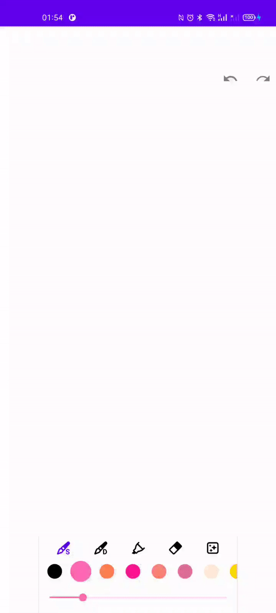

# Draw [](https://jitpack.io/#DonghanX/DrawView)

A simple Android view for drawing.



## Installation

#### Step 1. Add the JitPack repository to your build file

If you are using Gradle 6.8 or higher version, add it in `setting.gradle` at the end of repositories:
```gradle
dependencyResolutionManagement {
    repositories {
        maven { url 'https://jitpack.io' }
    }
}
```

If not, add it in your root `build.gradle` at the end of repositories:
```gradle
allprojects {
    repositories {
        maven { url 'https://jitpack.io' }
    }
}
```

#### Step 2. Add the dependency
```gradle
dependencies {
    implementation 'com.github.DonghanX:Draw:v1.0.2'
}
```

## Features
* Support multiple types of lines, including solid line, dashed line and Chisel Tip line.
* Eraser, Redo, Undo and ClearAll.
* Change the background of the Canvas by setting image resource or color.
* Keep track of the state after performing drawing actions.
* Save the Canvas as Bitmap.

## Usage

### Setup: 

#### Include `DrawView` in your layout.xml directly
```XML
<com.redhoodhan.draw.DrawView
    android:id="@+id/draw_view"
    android:layout_width="match_parent"
    android:layout_height="match_parent" />
```

#### (Alternatively) Include `DrawView` in your layout.xml with custom attributes setting
```XML
<com.redhoodhan.draw.DrawView
    android:id="@+id/draw_view"
    android:layout_width="match_parent"
    android:layout_height="match_parent"
    app:defaultBrushColor="@color/purple"
    app:defaultBrushSize="20F"
    app:defaultCanvasBackgroundImageRes="@drawable/img_draw_background_1"
    app:defaultEraserSize="15F" />
```

| Attribute Name | Format | Description |
| :----: | :----: | :----: |
| defaultBrushSize | Float | The default value of brush size |
| defaultEraserSize | Float | The default value of eraser size |
| defaultBrushColor | Color | The default stroke color of brush paint |
| defaultCanvasBackgroundColor | Color | The default color of canvas background |
| defaultCanvasBackgroundImageRes | Reference | The default image resource ID of canvas background|
> Note that setting `defaultCanvasBackgroundImageRes` will override the effect of `defaultCanvasBackgroundColor`.

### Further Usage: 

#### (Optional) Implement the callbacks
* `drawViewPressCallback`: Invoked when you press the `DrawView`.
* `undoStateCallback` / `redoStateCallback`: Invoked when the content in the `DrawView` changes. The given receiver parameter returns true if Undo / Redo action is available after the change.
```Kotlin
binding.drawView.apply {
    drawViewPressCallback = {
        // Do your stuff here
    }

    undoStateCallback = { isUndoAvailable ->
        // Do your stuff here
    }

    redoStateCallback = { isRedoAvailable ->
        // Do your stuff here
    }
}
```

#### Switch the type of lines by setting `lineType` variable in the `DrawView`
```Kotlin
binding.drawView.lineType = LineType.SOLID
```
`LineType` is utilized by `DrawView` to modify the path properties and paint options, such as `StrokeStyle`, `Alpha` and `PathEffect`.

| LineType | Description |
| :----: | :----: |
| LineType.SOLID | Solid line |
| LineType.DASH | Dashed line with gap interval that is calculated by `brushSize` |
| LineType.CHISEL | Chisel Tip line with alpha channel set to a specific value |
| LineType.ERASER | Solid line with `Xfermode` set to `PorterDuff.Mode.CLEAR` |

#### Undo
```Kotlin
binding.drawView.undo()
```

#### Redo
```Kotlin
binding.drawView.redo()
```

#### ClearAll
```Kotlin
binding.drawView.clearCanvas(needsSaving = true)
```
If `needsSaving` is true, then this ClearAll action is capable of being redone.

#### Set color background
```kotlin
binding.drawView.canvasBackgroundColor = Color.BLACK
```
or
```kotlin
binding.drawView.canvasBackgroundColor = ResourcesCompat.getColor(resources, yourColorResId, null)
```
> Note that `canvasBackgroundColor` receives a single color value in the form 0xAARRGGBB.

#### Set image resource background
```kotlin
binding.drawView.canvasBackgroundImg = yourImageResId
```

#### Change brush color
```kotlin
binding.drawView.brushColor = Color.BLACK
```
or
```kotlin
binding.drawView.brushColor = ResourcesCompat.getColor(resources, yourcolorResId, null)
```
> Note that `brushColor` receives a single color value in the form 0xAARRGGBB.

#### Change brush size
```kotlin
binding.drawView.brushSize = 10F
```
> Note that `brushSize` receives a single float value.  
> Also note that the minimum stroke width is set to 3F.

#### Change eraser size
```kotlin
binding.drawView.eraserSize = 10F
```
> Note that `eraserSize` receives a single float value.  
> Also note that the minimum stroke width is set to 3F.

#### Save the canvas as Bitmap
```kotlin
val bitmap = binding.drawView.saveAsBitmap()
```

## Thanks
* Inspired by `DrawingView` in [mvojtkovszky](https://github.com/mvojtkovszky).

## License
```
   Copyright 2022 Donghan X

   Licensed under the Apache License, Version 2.0 (the "License");
   you may not use this file except in compliance with the License.
   You may obtain a copy of the License at

   http://www.apache.org/licenses/LICENSE-2.0

   Unless required by applicable law or agreed to in writing, software
   distributed under the License is distributed on an "AS IS" BASIS,
   WITHOUT WARRANTIES OR CONDITIONS OF ANY KIND, either express or implied.
   See the License for the specific language governing permissions and
   limitations under the License.
```
